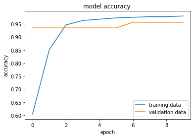
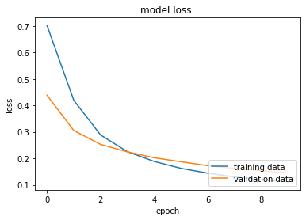

# DS-Project-3-Breast_Cancer_NN_Classifier
Classifying whether the tumor is 'Benign' or 'Malignant' . 

* Designed a model that predicts the chances of a patient having **Breast Cancer**. This is a small step towards how we can detect early symptoms of Breast Cancer which gives us a better chance of prevention.
* Dataset - This particular dataset can be imported from the sklearn.datasets library or you can download it from the kaggle resource given below.
* Model - The major aim in this project is to predict the type of tumor(Malignant or Benign) based on the features using some of the deep learning techniques and algorithms. Designed , Compiled and Trained a Neural-Network to classify the type of tumor.

## Code and Resources Used ##
**Python Version:** 3.10.5  
**Packages:** pandas, pandas-profiling, numpy, sklearn, matplotlib, tensorflow  
**For Web Framework Requirements:** _pip install -r requirements.txt_  
**Data Resources:** <https://www.kaggle.com/datasets/uciml/breast-cancer-wisconsin-data>

## About the Dataset ##
Features are computed from a digitized image of a fine needle aspirate (FNA) of a breast mass. They describe characteristics of the cell nuclei present in the image.  
The attributes which we recognize as the features of this model are as follows :  
1. **ID number**
The attributes which we recognize as the features of this model are as follows :  
2. **Diagnosis** (M = malignant, B = benign) - This is the label of the model. Output data that we use to classify the tumor which gives us indications of Breast Cancer.  

**Ten real-valued features are computed for each cell nucleus:**

a) **radius** (mean of distances from center to points on the perimeter)  
b) **texture** (standard deviation of gray-scale values)  
c) **perimeter**  
d) **area**  
e) **smoothness** (local variation in radius lengths)  
f) **compactness** (perimeter^2 / area - 1.0)  
g) **concavity** (severity of concave portions of the contour)  
h) **concave points** (number of concave portions of the contour)  
i) **symmetry**  
j) **fractal dimension** ("coastline approximation" - 1)  

The mean, standard error and "worst" or largest (mean of the three
largest values) of these features were computed for each image,
resulting in **30 features**.  
For instance, field 3 is Mean Radius, field
13 is Radius SE, field 23 is Worst Radius.

## EDA - Exploratory data analysis ## 
You can find all related EDA in my Github repository.  
Apart from the basic Data analysis which includes pandas function such as:  
1. value_counts for the label attribute   
2. Statistical insight using the describe functions   
3. finding strong postive and negative correlations using the corr() function  
You can check out the extensive EDA report for this dataset which I have generated using the pandas-profiling library. (This is a ninja technique :P)  
[ Note: High chances of lags and hangs for large datasets if you are on a potato just like me :) ]

## Model Building ##
I split the data into train and tests sets with a test size of 20%.

Then using the **StratifiedShuffleSplit** function from the sklearn.model_selection library, I make sure there are similar ratios of the ***Diagnosis*** column in both the test and train data sets.

After shuffling the data, I seperated the diagnosis column as the target/label obtaining features and labels of the dataset.

Finally,before using the train data to train the and build the neural network, I standardize the features by using the StandardScaler function.

#### Setting up layers for the neural network ####

After Initializing the neural network model,I define 3 layers for my model as follows:
1. 1st layer as the **input** layer - This layer consists of 30 neurons since we have 30 features for our dataset. Important to Flatten it since it requires a single dimension array  
2. the middle **hidden** layer - Can have random number of neurons and use the **'ReLU'** activation function since I dont want to activate all the neurons at the same time. 
3. Finally, the **output** layer - Number of neurons must be equal to the number of output classes. In our case this is **2** since we want to classify the tumor either as 'Benign' or 'Malignant'. For my activation function I use the **Sigmoid function** which is th esame as Logistic Regression.
[Note: You can do more research on different activation functions and also play around with the number of layers. Although this might make your model more susceptible to overfitting.]    

#### Compiling the neural network  ####

After setting up the layers, I compiled my model as follows:
* For the Optimizer I pick the **'adam's optimization algorithm** as it uses the principle of stochastic gradient descent.
* For my loss function I chose **sparse_categorical_crossentropy** because the labels are labeled as integers.
* Finally I choose **accuracy** for metrics.

#### Training the model ####

After setting up the layers and compiling the model, we finally use the processed training data to train our NN-model with **epochs** set at 10. This is the number of times we send our data through the model.

## Visualizing Accuracy and Loss ##

The first epoch gave us a **accuracy of 60%** and a **loss of 70%** which is not the best, but after a few more runs the final epoch gave us a **accuracy of 98%** and a **loss of 11%** which is an amazing result. This can improve even more if the model is trained carefully with  more layers.

I have plotted the **model accuracy** and **model loss** graphs for us to visualize it and get a better understanding of it.

## Testing the model on the test data ##
* Finally we pass the test data through the model to evaluate the model and make sure there is no overfitting or underfitting.
* It gives us a **loss of 13%** and **accuracy of almost 96.5%** which is pretty good.

## Defining a predictor function ##
The last step of this project is to define a predictor function that takes in any input data and utilizes this model to identify the type of tumor and give us more room for prevention.   
**As we are aware that prevention is better than cure, this model takes us a step closer towards that prevention.** 
